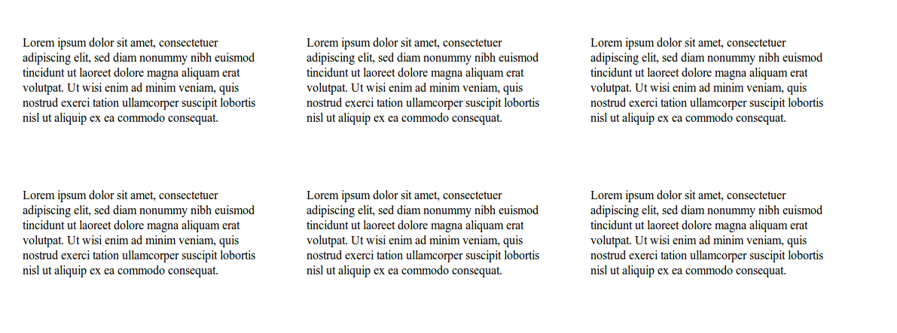

# 1. Verktyg, HTML och grundläggande CSS
Lös uppgifterna genom att skapa nya filer i den här mappen. Det gör du enklast i VS Code eller genom terminalens 'touch'-kommando.

-------------------

## LEVEL 1 ★☆☆

Skapa en webbsida som mitt på skärmen har en lista med 5 länkar till olika sökmotorer (Duckduckgo, Google, Searchpage, Bing, Yahoo). När man klickar på en länk ska länken öppnas i en ny flik.

1. Skapa en HTML fil.
2. Lägg till nödvändig HTML, och stylea denna med inline CSS (ex. style="text-align: center;").
3. Kopiera filens filväg genom att klicka på filnamnet till vänster i VS Code och klicka på 'Copy Path'.
4. Klistra in filvägen i din webbläsare.

-------------------

## LEVEL 2 ★★☆

Ni blev under lektion 1 introducerade till Terminalen och hur denna används. Öppna terminalen och navigera till denna mapp, varpå ni ska skapa en ny mapp som innehåller en fil kallad 'success.txt'.

1. Navigera med hjälp av 'cd' till denna mapp.
2. Skapa en ny mapp. (Tips: Stackoverflow!)
3. Navigera till den nyskapade mappen.
4. Skapa en ny .txt-fil. (Tips: Stackoverflow!)

-------------------

## LEVEL 3 ★★★

Skapa ett CSS-grid som ser ut som följande, och fyll det med platshållartext (ex. Lorem ipsum https://www.lipsum.com/).



1. Skapa en HTML fil.
2. Lägg till nödvändig HTML, och stylea denna med inline CSS (ex. style="text-align: center;").
3. Kopiera filens filväg genom att klicka på filnamnet till vänster i VS Code och klicka på 'Copy Path'.
4. Klistra in filvägen i din webbläsare.

-------------------

```
8             8             w   w 8 8 8 
8 Yb  dP .d8b 8.dP .d88    w8ww w 8 8 8 
8  YbdP  8    88b  8  8     8   8 8 8 " 
8   dP   `Y8P 8 Yb `Y88     Y8P 8 8 8 w 
   dP
```
